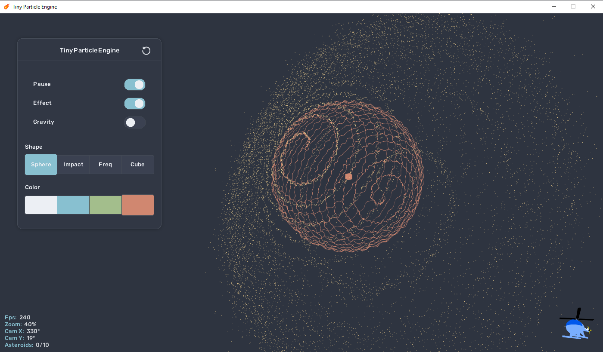
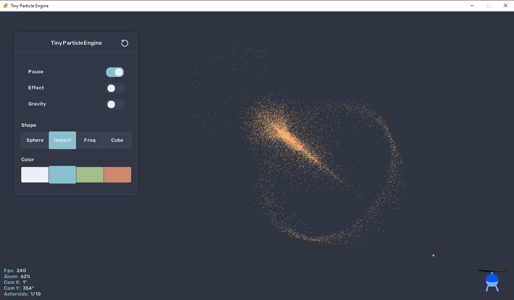
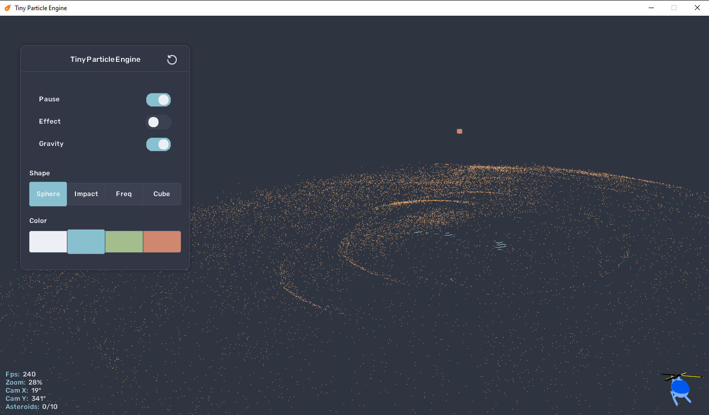

# tiny-particle-engine  

My attempt at some linear algebra and collision detection between points in 3D-space.   
Built with C# and [Monogame](https://monogame.net/).  

* Shot asteroids from any angle
* Transitions, Animations and 3D-effects
* Camera controls: Zoom, Rotate, and Pan
* Fully dynamic: Multiple effects/animations/asteroids can run simultaneously

## Requirements
* A computer! (Windows)
* [.NET 9.0 SDK](https://dotnet.microsoft.com/en-us/download/dotnet)    
  
<details>
<summary>Setup and Run</summary>  

```
git clone https://github.com/Peppson/tiny-particle-engine.git &&
cd tiny-particle-engine/src &&
dotnet run -c Release
```

</details>    
&nbsp;  

  

Asteroid impact


Gravity
 


## Todos
- [ ] Replace the helicopter with a proper 3D-axis model.
- [ ] Add effect for "Impact" shape.
&nbsp;