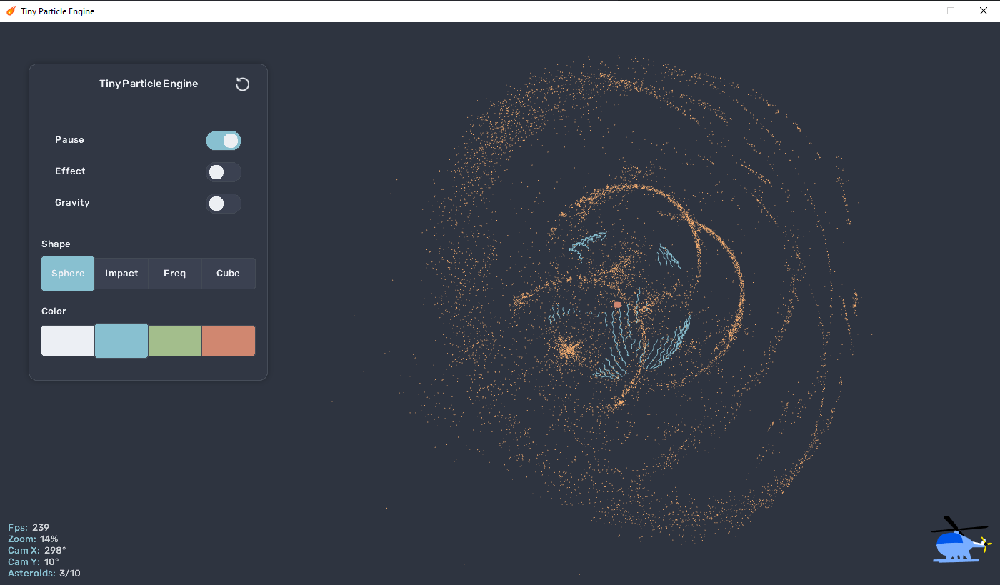

# tiny-particle-engine  

My attempt at some linear algebra and collision detection between points in 3D-space.   
Built with C# and [Monogame](https://monogame.net/).  

* Shoot asteroids from the mouse pointer
* Transitions, Animations and 3D-effects
* Camera controls: Zoom, Rotate, and Pan
* Multiple effects/animations/asteroids can run simultaneously

## Screenshots

  

Impact


Destroyed sphere


## Try it out?

<details>
<summary>Run from source</summary>  

#### Requirements:

* A computer! (Windows)
* [.NET 8.0](https://dotnet.microsoft.com/en-us/download/dotnet)

``` bash
git clone https://github.com/Peppson/tiny-particle-engine.git &&
cd tiny-particle-engine/src &&
dotnet run -c Release
```

</details> 

<details> 
<summary>Download prebuilt</summary>

#### Requirements:

* A computer! (Windows)

Grab the latest release from the [Releases tab](https://github.com/Peppson/tiny-particle-engine/releases)  

</details>


## Todo
- [ ] Replace the helicopter with a proper 3D-axis model.
&nbsp;
