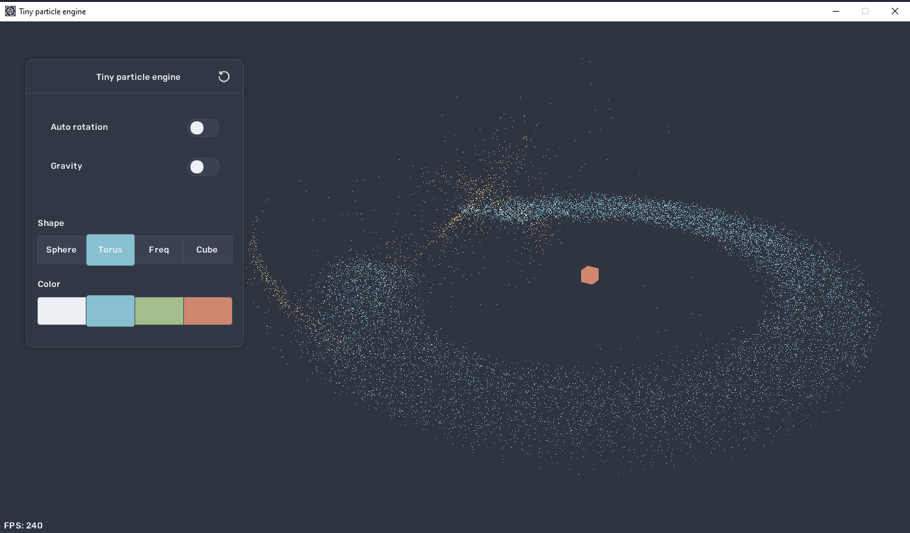
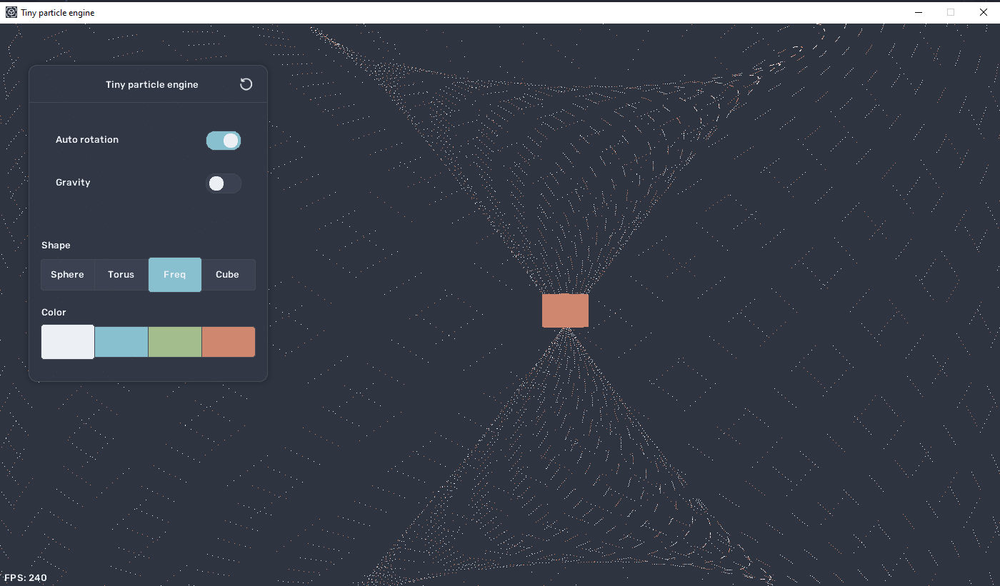

# tiny-particle-engine ☄️

Work in progress 👷  
My attempt at some linear algebra and collision detection between points in 3D space.  
Built with C# and [Monogame](https://monogame.net/).  

* Transitions/animations when switching shapes
* Camera: drag, zoom and rotate
* Random 3D-effects
* Multiple effects and animations can run simultaneously

## Requirements
* A computer! (windows)
* [.NET 9.0 SDK](https://dotnet.microsoft.com/en-us/download/dotnet)    
  
<details>
<summary>Setup and Run</summary>  

```
git clone https://github.com/Peppson/tiny-particle-engine.git &&
cd tiny-particle-engine/src &&
dotnet run -c Release
```

</details>

&nbsp;  
**Asteriod impact**
  

  

&nbsp;
